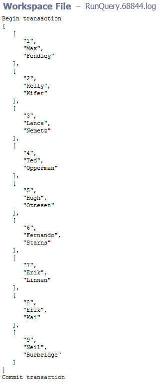

# Perl DBI links

More information can be found in the [Perl DBI documentation](http://dbi.perl.org/).

# Perl DBD links

Perl DBD modules can be found in the  [CPAN documentation](http://search.cpan.org/).

# Setting up the plugin configuration

For all parameter descriptions below, required parameters are shown in
bold italics.

Plugin configurations are sets of parameters that apply across some or
all of the plugin’s procedures. They reduce repetition of common values,
create predefined sets of parameters for end users, and securely store
credentials where needed. Each configuration is given a unique name that
is entered in designated parameters on procedures that use them.

# Plugin configuration parameters

<table>
<colgroup>
<col style="width: 50%" />
<col style="width: 50%" />
</colgroup>
<thead>
<tr class="header">
<th style="text-align: left;">Parameter</th>
<th style="text-align: left;">Description</th>
</tr>
</thead>
<tbody>
<tr class="odd">
<td style="text-align: left;">
Configuration Name
</td>
<td style="text-align: left;">
Provide a unique name for the
configuration. (Required)
</td>
</tr>
<tr class="even">
<td style="text-align: left;">
User Name
</td>
<td style="text-align: left;">
Provide the user login ID for your
database connection. (Required)
</td>
</tr>
<tr class="odd">
<td style="text-align: left;">
Password
</td>
<td style="text-align: left;">
Provide the user-specified password.
(Required)
</td>
</tr>
</tbody>
</table>

# Plugin procedures

# ExecuteQuery

This procedure creates a database connection through the Perl DBI module
and a Perl DBD module to execute an SQL statement against the
corresponding database.

You can access any database indirectly by using a preconfigured ODBC.

Additional Perl modules are required for the following databases:

<table>
<colgroup>
<col style="width: 33%" />
<col style="width: 33%" />
<col style="width: 33%" />
</colgroup>
<thead>
<tr class="header">
<th style="text-align: left;">Database</th>
<th style="text-align: left;">Module name</th>
<th style="text-align: left;">CPAN reference</th>
</tr>
</thead>
<tbody>
<tr class="odd">
<td style="text-align: left;">
Oracle
</td>
<td style="text-align: left;">
DBD-Oracle
</td>
<td style="text-align: left;">
<a href="http://search.cpan.org/~pythian/DBD-Oracle-1.30/Oracle.pm">DBD-Oracle at CPAN</a>
</td>
</tr>
<tr class="even">
<td style="text-align: left;">
SQLite
</td>
<td style="text-align: left;">
DBD-SQLite
</td>
<td style="text-align: left;">
<a href="http://search.cpan.org/~adamk/DBD-SQLite-1.33/lib/DBD/SQLite.pm">DBD-SQLite
at CPAN</a>
</td>
</tr>
<tr class="odd">
<td style="text-align: left;">
Postgres
</td>
<td style="text-align: left;">
DBD-Pg
</td>
<td style="text-align: left;">
<a href="http://search.cpan.org/dist/DBD-Pg/Pg.pm">DBD-Pg at
CPAN</a>
</td>
</tr>
</tbody>
</table>

<table>
<colgroup>
<col style="width: 50%" />
<col style="width: 50%" />
</colgroup>
<thead>
<tr class="header">
<th style="text-align: left;">Parameter</th>
<th style="text-align: left;">Description</th>
</tr>
</thead>
<tbody>
<tr class="odd">
<td style="text-align: left;">
Database engine
</td>
<td style="text-align: left;">
Choose the database engine you want to
connect to. Available options are: SQLServer, MySql, Oracle, Sqlite,
Postgres, or an ODBC connection to any database. (Required)
</td>
</tr>
<tr class="even">
<td style="text-align: left;">
Database name
</td>
<td style="text-align: left;">
The name of the database you want to
use. (Required)
</td>
</tr>
<tr class="odd">
<td style="text-align: left;">
Server
</td>
<td style="text-align: left;">
Database server name.
(Required)
</td>
</tr>
<tr class="even">
<td style="text-align: left;">
Port
</td>
<td style="text-align: left;">
Database port. Common default ports
are:

<ul>
<li>
3306 (Mysql)
</li>
<li>
1433 (SQLServer)
</li>
<li>
1521 (Oracle)
</li>
<li>
5432 (Postgres)
</li>
</ul></td>
</tr>
<tr class="odd">
<td style="text-align: left;">
Enable transactions
</td>
<td style="text-align: left;">
If checked, this option protects your
data in case of errors.
</td>
</tr>
<tr class="even">
<td style="text-align: left;">
Display format
</td>
<td style="text-align: left;">
Choose a display format.
(Required)
</td>
</tr>
<tr class="odd">
<td style="text-align: left;">
Sql query
</td>
<td style="text-align: left;">
The query to run against the
database.
</td>
</tr>
<tr class="even">
<td style="text-align: left;">
Sql file
</td>
<td style="text-align: left;">
Absolute path to a SQL script.
</td>
</tr>
<tr class="odd">
<td style="text-align: left;">
Configuration name
</td>
<td style="text-align: left;">
Name of the configuration that contains
the database user and password. (Required)
</td>
</tr>
<tr class="even">
<td style="text-align: left;">
Result (output property path)
</td>
<td style="text-align: left;">
Property name used to store the result
of queries.
</td>
</tr>
</tbody>
</table>

# BackUpDB

Creates a backup for the specified database.

<table>
<colgroup>
<col style="width: 50%" />
<col style="width: 50%" />
</colgroup>
<thead>
<tr class="header">
<th style="text-align: left;">Parameter</th>
<th style="text-align: left;">Description</th>
</tr>
</thead>
<tbody>
<tr class="odd">
<td style="text-align: left;">
Database engine
</td>
<td style="text-align: left;">
Choose the database engine you want to
connect to. Available options are: SQLServer, MySql, Oracle, Postgres
and Sqlite. (Required)
</td>
</tr>
<tr class="even">
<td style="text-align: left;">
Command Line Utility
</td>
<td style="text-align: left;">
Absolute path to a backup command
utility. (Required):

<ul>
<li>
<code>mysqldump</code> (Mysql)
</li>
<li>
<code>osql</code> (SQLServer)
</li>
<li>
<code>exp</code> (Oracle)
</li>
<li>
<code>pg_dump</code> (Postgres)
</li>
</ul></td>
</tr>
<tr class="odd">
<td style="text-align: left;">
Database name
</td>
<td style="text-align: left;">
The name of the database to back up.
(Required)
</td>
</tr>
<tr class="even">
<td style="text-align: left;">
Server
</td>
<td style="text-align: left;">
Database server name.
</td>
</tr>
<tr class="odd">
<td style="text-align: left;">
Port
</td>
<td style="text-align: left;">
Database port. Some of the default
ports are:

<ul>
<li>
3306 (Mysql)
</li>
<li>
1433 (SQLServer)
</li>
<li>
1521 (Oracle)
</li>
<li>
5432 (Postgres)
</li>
</ul></td>
</tr>
<tr class="even">
<td style="text-align: left;">
Configuration name
</td>
<td style="text-align: left;">
Name of the configuration that contains
the database user and password. (Required)
</td>
</tr>
<tr class="odd">
<td style="text-align: left;">
Name of the backup file
</td>
<td style="text-align: left;">
Name of the backup file (without
extension). If you leave the field blank, the file name is
"backup".
</td>
</tr>
<tr class="even">
<td style="text-align: left;">
Destination path
</td>
<td style="text-align: left;">
The path where you want to store your
backup file. (Required)
</td>
</tr>
</tbody>
</table>

# Examples and use cases

The following example shows how to create a configuration:

The following example shows a list of server configurations:

The following example shows a completed ExecuteQuery parameter form:

The following example shows output for ExecuteQuery:

The following example shows a completed MySql backup parameter form:

The following example shows output for a MySQL backup:

The following example shows a completed Oracle backup parameter form:

The following example shows output for an Oracle backup:

The following example shows a completed SQL Server backup parameter
form:

The following example shows output for a SQL Server backup:

# Release notes

## EC-DBI 2.0.4

-   The documentation has been migrated to the main documentation site.

## EC-DBI 2.0.3

-   Added metadata that is required for 9.0 release.

## EC-DBI 2.0.2

-   Fixed issue with configurations being cached for Internet Explorer(R).

## EC-DBI 2.0.1

-

## EC-DBI 2.0.0

-   The result (output property path) parameter was added.

-   JSON and XML formats for results were added.

## EC-DBI 1.0.2

-   Procedure names were changed in the step picker section.

## EC-DBI 1.0.1

-   XML parameter panels were added.

-   The Help page was updated.

## EC-DBI 1.0.0

-   Initial release.
